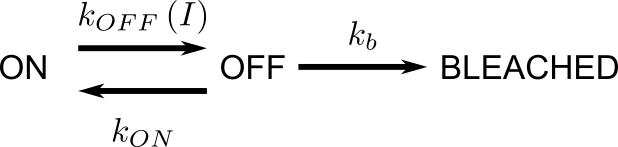
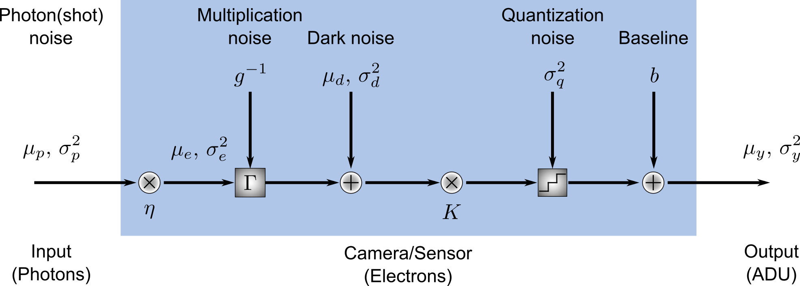

Simulation Models
=================

Fluorescence dynamics
---------------------

The fluorescence dynamics in SASS are modeled as `memoryless state
systems`_. Such systems are comprised of two or more states that a
fluorophore may occupy at any given time. During the course of an
experiment, the fluorophore may randomly transition from its current
state :math:`m` to a new state :math:`n`, and the probability with
which this transition occurs is determined partly by the so-called
rate constant :math:`k_{mn}`.

Memorylessness means that the probability to transition to any
accessible state does not depend on the time that the fluorophore has
already spent in its current state. This assumption is well-founded:
it is unlikely that a fluorescent molecule possesses some mechanism to
keep track of time. Under the assumption of memorylessness, the length
of the time interval :math:`t` that is spent by a fluorophore in its
current state :math:`S_m` before making a transition to state
:math:`S_n` is given by an exponential probability density function

.. math::

   p_{mn} \left( t \right) = k_{mn} e^{ -k_{mn} t }

When multiple states are accessible from :math:`S_m`, then it may be
shown that the probability that the fluorophore will have transitioned
to the specific state :math:`S_n` is

.. math::

   P \left( S_n, t = \infty | S_m, t = 0 \right) = \frac{ k_{mn} }{ K
   }

where :math:`K \equiv \sum_n k_{mn}`. Thus, the rate constants
determine the relative probabilities of the transitions to different
states.

.. _`memoryless state systems`: https://en.wikipedia.org/wiki/Memorylessness

Algorithm for state system simulations
++++++++++++++++++++++++++++++++++++++

The algorithm for simulating the state transitions proceeds as
follows:

1. The fluorescent molecule is assigned a pre-defined starting state
   :math:`S_m`.
2. Next, a random transition time from the molecule’s current state is
   drawn for each accessible state :math:`n` from an exponential
   distribution, :math:`\forall n : t_{mn} \sim \text{Exp} \left(
   \tau_{mn} \right)` where :math:`\tau_{mn} \equiv 1 / k_{mn}` is the
   average of the distribution.
3. The smallest value from this set of transition times is computed
   and stored as the molecule’s transition time :math:`T \equiv
   \text{Min} \left( { t_{mn} }\right)`. The corresponding molecular
   state :math:`S_n` is stored for use in the next step.
4. The simulation time is advanced one time step. If, during this
   time, a total amount of time has elapsed that is greater than the
   previously calculated transition time :math:`T`, then the molecule
   is transitioned into its next state. The new next state and its
   transition time are generated and stored in the manner just
   described.
5. This process is repeated as the simulation continues until a
   pre-determined number of time steps have occurred or it is stopped
   by the user.

Non-stationary state transitions
++++++++++++++++++++++++++++++++

In PALM/STORM type experiments, one or more rate constants depend on
the light irradiance (power per area) of one or more light
sources. Indeed, adjusting the power during an acquisition is a common
way to optimize the quality of datasets derived from such experiments
because it offers a direct way to tune the density of fluorophores in
a light-emitting state.

When the laser irradiance varies with time, so too do the rate
constants and, therefore, the relative numbers of the fluorophores
found in each state. Fortunately, the memorylessness property makes it
easy to adapt the above algorithm to account for a changing
irradiance. At each time step of the simulation, a check is performed
to see whether the laser irradiance has changed. If it has, new rate
constants are computed and a new transition time and state are derived
from the algorithm described above.

State system representations
++++++++++++++++++++++++++++

As an example of how state systems are represented in SASS, consider
the simplified three-state fluorophore model pictured below.

In this simple model, the fluorophore may be in a fluorescence
emitting (ON) state, a non-emitting (OFF) state, and an irreversibly
bleached state from which it may never recover. (This model is perhaps
too simplistic as it does not account for the typically numerous
non-emitting states that real fluorophores possess. It does, however,
capture the essential behavior in a SMLM experiment.)

The transition rate from OFF to ON is a constant, :math:`k_{ON}`, as
is the rate :math:`k_{b}` from the OFF to the BLEACHED state. The ON
to OFF rate :math:`k_{OFF}` is a function of the irradiance and may be
expanded as

.. math::

   k_{OFF} \left( I \right) = k_{OFF,0} + k_{OFF,1} I + k_{OFF,2} I^2 + \cdots

Let's assume that :math:`k_{OFF}` is at most linear with the
irradiance. Then, the full dynamics of the fluorophore may be
specified by a :math:`3 \times 3 \times 2` matrix :math:`M`

.. math::
   \begin{align*}
     M_{:,:,1} &= 
       \left[
       \begin{array}
         0        & k_{OFF,0} & 0   \\
         k_{ON,0} & 0         & k_{b,0} \\
         0        & 0         & 0
       \end{array}
       \right] \\
     M_{:,:,2} &= 
       \left[
       \begin{array}
         0        & k_{OFF,1} & 0   \\
         0        & 0         & 0   \\
         0        & 0         & 0
       \end{array}
       \right]
   \end{align*}

(Note that some browsers may not render the first elements of the
above matrices. Both elements are 0.)

The rows of each matrix represent the state being *transitioned from*
(ON, OFF, and BLEACHED states respectively), while the columns
represent the state that is *transitioned to* (in the same order). For
example, the first row of :math:`M_{:,:,1}` indicates that
:math:`k_{OFF,0}` is the zero-order term for the rate coefficient
polynomial expansion in :math:`I` from the ON state to the OFF
state. Here, row number one corresponds to the ON state and column
number 2 corresponds to the OFF state. The corresponding element in
the second matrix :math:`M_{:,:,2}` is :math:`k_{OFF,1}` and indicates
that the rate coefficient is linearly proportional to the
irradiance. If there were a third matrix :math:`M_{:,:,3}` with a
:math:`k_{OFF,2}` element, then this would indicate a second-order
polynomial term for the dependence of :math:`k` on :math:`I`. Zeros
for all the remaining elements in :math:`M_{:,:,2}` indicate that no
other rates depend on the irradiance.

Any fluorophore state system may be implemented in SASS by specifying
the matrix :math:`M`.

Shot noise and sensor noise
---------------------------

There are two noise models employed by SASS: photon shot noise—which
accounts for the quantum nature of fluorescence emission—and sensor
noise. Sensor noise is based on the models described in these two
documents:

- `Basden, Haniff, and Mackay, "Photon counting strategies with
  low-light-level CCDs," Mon. Not. R. Aston. Soc. 345,
  1187-1197 (2003)
  <http://onlinelibrary.wiley.com/doi/10.1046/j.1365-8711.2003.07020.x/abstract>`_
- `The EMVA 1288 Standard
  <http://www.emva.org/standards-technology/emva-1288/>`_

Sensor noise models in SASS currently do not account for spatial
non-uniformities or defect pixels; each pixel is assumed independent
from all other pixels. Furthermore, each pixel has identical
statistical properties to all other pixels.

Additional assumptions employed in SASS include:

- The sensor is linear.
- Noise sources are wide sense stationary with respect to time and
  space.
- Only quantum efficiency is wavelength-dependent.
- Only dark current is temperature dependent.

Shot noise
++++++++++

Photon shot noise (or just shot noise) represents fluctuations in the
number of photons incident on a pixel between different frame
exposures. It is due to the quantum nature of fluorescence emission
and is not dependent upon any properties of the image sensor.

Let :math:`\mu_p` represent the mean number of photons incident upon a
pixel during the exposure of a given frame. The number of
photoelectrons :math:`\mu_e` generated by these photons is given by 

.. math::

   \mu_e = \eta \mu_p

where :math:`\eta` is the quantum efficiency of the sensor and, in
general, depends on the wavelength of the light.

Fluorescence emission is well-modeled as a Poisson process. Under this
condition, the mean number of photoelectrons will be equivalent to the
variance :math:`sigma_e^2` of the number of photoelectrons generated
over time.

.. math::

   \sigma_e^2 = \mu_e

Sensor temporal noise
+++++++++++++++++++++

Within the sensor, photoelectrons are converted to analog-to-digital
units (ADU) through a step-wise process involving

1. the amplification of the signal and the addition of multiplication
   noise (for cameras possessing a multiplication register),
2. the addition of dark noise, which consists of readout noise and
   dark current noise,
3. the conversion of electrons to voltages by multiplication with a
   constant system gain factor,
4. and quantization of the voltage to discrete ADU values and
   summation with a constant baseline value.

The number of photoelectrons that is generated within the pixels of an
electron multiplying CCD (EMCCD) is amplified within a serial register
via electron avalanche multiplication. This process is random and
introduces a multiplicative noise that is modeled as a gamma
distribution :math:`\Gamma \left( \mu_e, g^{-1} \right)` where
:math:`g^{-1}` is the inverse value of the camera's EM gain. (Note
that in some notations the second parameter of the gamma distribution
is denoted directly by the gain, not its inverse.) Sensors such as
sCMOS cameras that lack a serial multiplication register are modeled
in SASS by setting the EM gain value to 0.

Following the multiplication register, dark current noise is added to
the signal to account for thermally excited electrons within the
pixels. Dark current is modeled as a zero-mean Gaussian distribution
whose standard deviation is a free parameter. Typically, the value for
this parameter is found by assuming that dark current is also a
Poisson process whose variance is equivalent to the mean number of
dark current electrons :math:`\mu_I t_{exp}`. Here, :math:`\mu_I` is
the dark current in electrons per time and :math:`t_{exp}` is the
exposure time of the frame. :math:`\mu_I` is dependent on temperature
in general. Dark current is often negligible in microscopy
experiments, so it may often be safely ignored.

The total number of amplified photoelectrons and dark current
electrons are then readout as a voltage, which introduces a readout
noise. Readout noise is modeled as a zero-mean Gaussian distribution
whose standard deviation is also a free parameter. The value for this
parameter is often given on camera specification sheets as a median or
root-mean-square (RMS) number of electrons. (`RMS readout noise is
preferred for sCMOS cameras because of pixel-to-pixel variation in the
values
<http://camera.hamamatsu.com/us/en/technical_guides/read_noise/index.html>`_.)
Some camera manufacturers will combine dark current and readout noise
into a single noise source known as dark noise with mean :math:`\mu_d`
and variance :math:`\sigma_d^2`.

After addition of the readout noise, the voltage signal is amplified
by another free parameter found on camera specification sheets, the
system gain :math:`K`. Finally, the signal is quantized into discrete
ADUs and optionally summed with a constant baseline :math:`b` to
prevent negative pixel values. This baseline is often about 100
ADU. The quantization noise is a uniform distribution with variance
:math:`\sigma_q^2 = \frac{1}{12} \, ADU^2`. It is automatically
accounted for in the code by converting from double to integer data
types.
