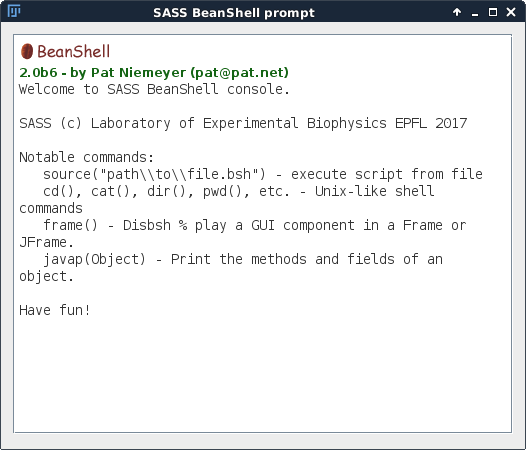

Scripting Interface
===================

The SASS Command Prompt
-----------------------

SASS includes a beanshell scripting interface that supports the
execution of either pre-made or *ad hoc* scripts for easily running
and repeating simulations. The interface is accessed through the
Plugins menu bar via *Plugins > SASS > Command Prompt*.

Inside this prompt you have access to a few Unix-like shell commands
by appending :code:`();` to the command name. For example::

  pwd();

prints the current working directory.

Running Beanshell Scripts
-------------------------

Beanshell scripts that setup and launch localization microscopy
simulations may be run with the :code:`source()` command. For security
reasons, you will want to ensure that the file you are sourcing is
trustworthy because the Beanshell interpreter will run whatever code
is contained within the file.

Here is how one would launch the **example_run_generator.bsh** example
script from within the command prompt and which launches a basic PALM
simulation::

  source("/path/to/examples/example_run_generator.bsh");

Please be sure to change the path argument above to one for your
specific machine, which includes changing `/` to `\\\\` if you are
using Windows.

From the shell/command line
+++++++++++++++++++++++++++

To better facilitate batch processing and complex workflows, we made
it possible to run a Beanshell script directly from the command line
by invoking the SASS .jar directly through the Java Virtual Machine::

  java -jar path/to/SASS/SASS.jar -s path/to/examples/example_run_generator.bsh

As you can see, you only need to pass the path to the .jar file on
your machine and a **-s** argument followed by the path to the
Beanshell script.

Example Scripts
---------------

Example scripts for performing 2D and 3D simulations with PALM and
STORM models may be found `in the examples folder
<https://github.com/MStefko/SASS/tree/master/scripts>`_ in the SASS
parent directory.

https://github.com/MStefko/SASS/tree/master/scripts
